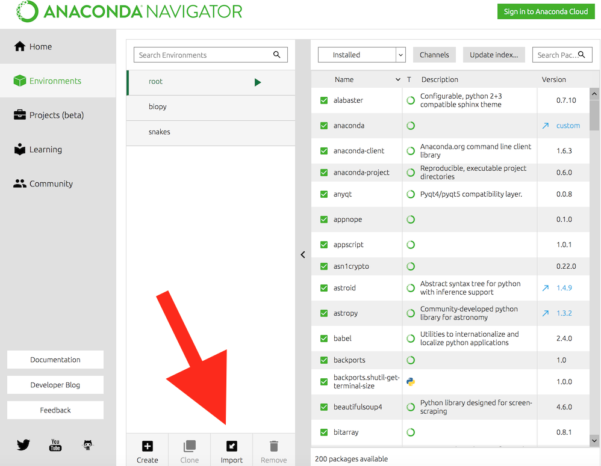
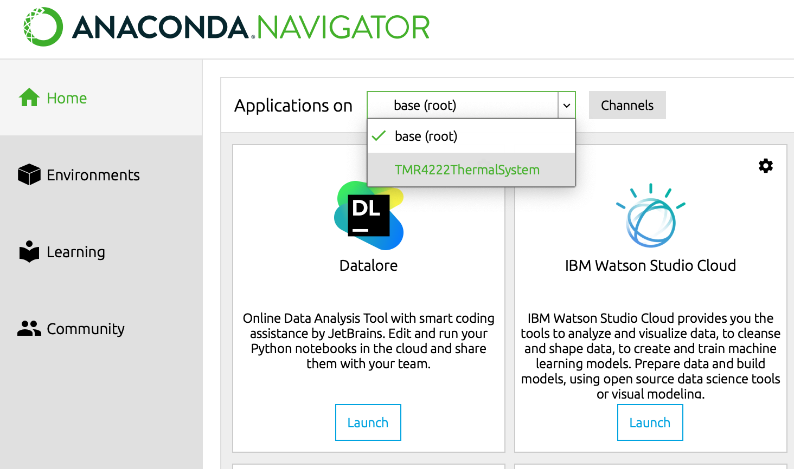

# TMR4222 Heat Transfer Course Supplement Material

## Setting up the working environment
These materials are written in Jupyter Notebook, which is based on Python. You should have a 
minimum knowledge of Python to manipulate it. Don't worry. You will be still see and run the 
code as it is. But you still need to set up the environment to do that. 

### Install the right version of Python with Anaconda(>=3.8)
We recommend you to use the <em>Anaconda</em> distribution to install python. Use this 
[link](https://www.anaconda.com/download) to download a proper version for your OS.

### Install Git
This step is optional. You can download the repository from the webpage as a zip file. But, I 
strongly recommend you to learn about Git if you haven't used it yet. You can install Git from 
[here](https://git-scm.com/downloads). If you are not sure if you have git already installed or 
not, just try following command on your terminal:
```commandline
git --version
```
Once you installed the git, open the terminal and go to any folder that you like to place the 
material in the terminal and type the following:
```commandline
git clone https://github.com/kevinksyTRD/HeatTransferCourse.git
```

If you don't like a terminal, Github Desktop is an option. You can download it 
[here](https://desktop.github.com/).

### Create a virtual environment
In order to prevent any conflict with the packages that you already have installed and what will 
work for these notebooks, creating the environment by importing the `TMR4222ThermalSystem.yaml`. 

#### Step 1 of 2: Update your Anaconda installation 
First, open an Anaconda prompt. 
- Windows:
    - Open Anaconda Prompt from the Start menu.
    - Close all other open Anaconda programs, including Anaconda Navigator and Spyder.
- Mac:
    - Open Terminal from Launchpad, or from the Applications folder (look inside the Utilities folder).
- Linux:
    - Open a terminal window.

Then, run the following two commands:

`conda update -y conda`

and:

`conda update -y anaconda`

#### Step 2 of 2: Import the .yaml file

Open Anaconda Navigator and click the Environments tab in the left menu. 
Then click Import and select the `TMR4222ThermalSystem.yaml` file.



## Run Jupyter Lab
Launch Anaconda Navigator. First select the environment that you have imported.



Now click Jupyter Lab launch button.